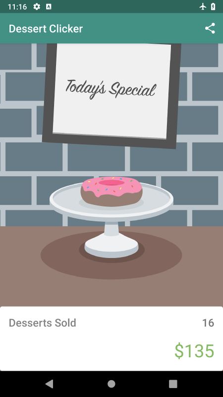

# DessertClicker App

#### [Android Basics in Kotlin](https://developer.android.com/courses/android-basics-kotlin/course) - [Unit 3](https://developer.android.com/courses/android-basics-kotlin/unit-3) - [Pathway 1](https://developer.android.com/courses/pathways/android-basics-kotlin-unit-3-pathway-1) - [Activity 4](https://developer.android.com/codelabs/basic-android-kotlin-training-activity-lifecycle) - Stages of the activity lifecycle: DessertClicker App Codelab
The codelab walks us through the lifecycle of an activity, how to use logging, and preserving activity state. The added code was provided within the codelab, and I only made slight modifications here and there.

Other than **App Preview** ( image is from the codelab ), the following was part of the original readme file ( with modifications made to the headings to conform to the style I use ).

# Introduction
DessertClicker is a game about making desserts. Press the button, make a dessert,
earn the big bucks.

You use this app in the course to explore the Android lifecycle and log messages to
the Android console (Logcat).

# Pre-requisites
You need to know:
- How to open, build, and run apps with Android Studio.
- What an activity is, and how to create one in your app.
- What the activity's onCreate() method does, and the kind of operations
  that are performed in that method.

# Getting Started  
1. Download and run the app.

# App Preview 
  